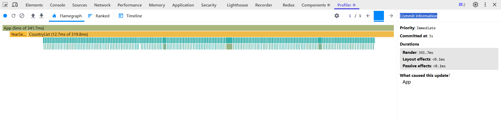
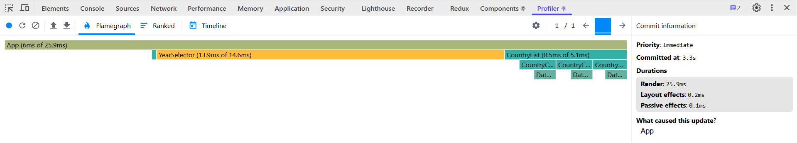
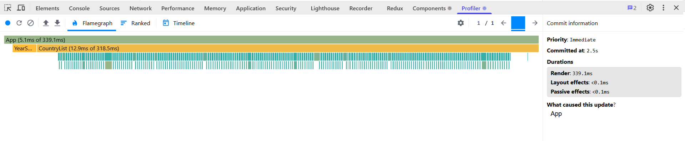
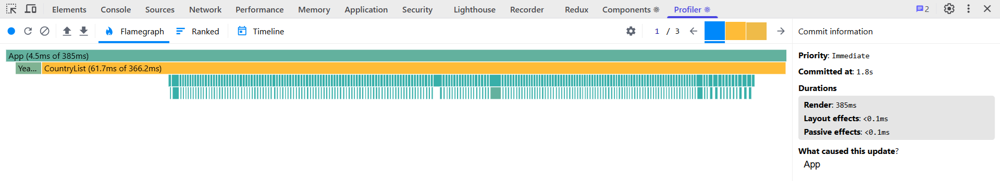
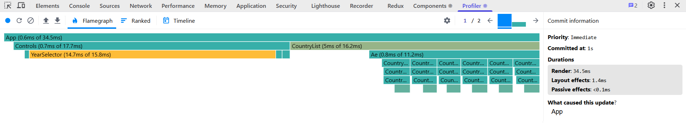
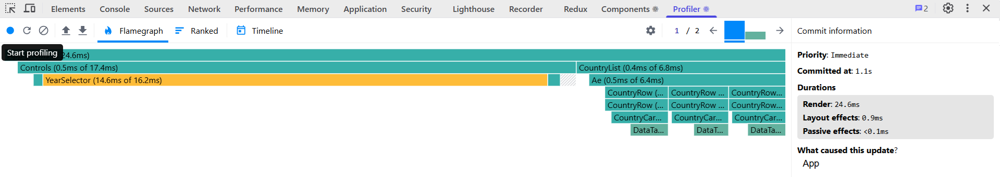
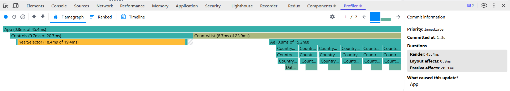
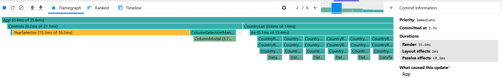

# Performance Optimization Report

## Baseline Measurements

### Interaction A: Sort countries

- **Commit duration**: <0.1ms
- **Render duration**: 341.7ms
- **Screenshot**: 

### Interaction B: Search countries

- **Commit duration**: 0.3ms
- **Render duration**: 25.9ms
- **Screenshot**: 

### Interaction C: Change year

- **Commit duration**: <0.1ms
- **Render duration**: 339.1ms
- **Screenshot**: 

### Interaction D: Toggle column

- **Commit duration**: <0.1ms
- **Render duration**: 385ms
- **Screenshot**: 

## Optimized Measurements

### Interaction A: Sort countries

- **Commit duration**: 1.4ms
- **Render duration**: 34.5ms
- **Screenshot**: 

### Interaction B: Search countries

- **Commit duration**: 0.9ms
- **Render duration**: 24.6ms
- **Screenshot**: 

### Interaction C: Change year

- **Commit duration**: 0.9ms
- **Render duration**: 45.4ms
- **Screenshot**: 

### Interaction D: Toggle column

- **Commit duration**: 1ms
- **Render duration**: 35.6ms
- **Screenshot**: 

## Summary of Improvements

| Interaction      | Baseline (ms) | Optimized (ms) | Improvement |
| ---------------- | ------------- | -------------- | ----------- |
| Sort countries   | 341.7         | 34.5           | +89.9%      |
| Search countries | 25.9          | 24.6           | +5.0%       |
| Change year      | 339.1         | 45.4           | +86.6%      |
| Toggle column    | 385           | 35.6           | +90.8%      |
| **Average**      | **272.9**     | **35.0**       | **+87.2%**  |
